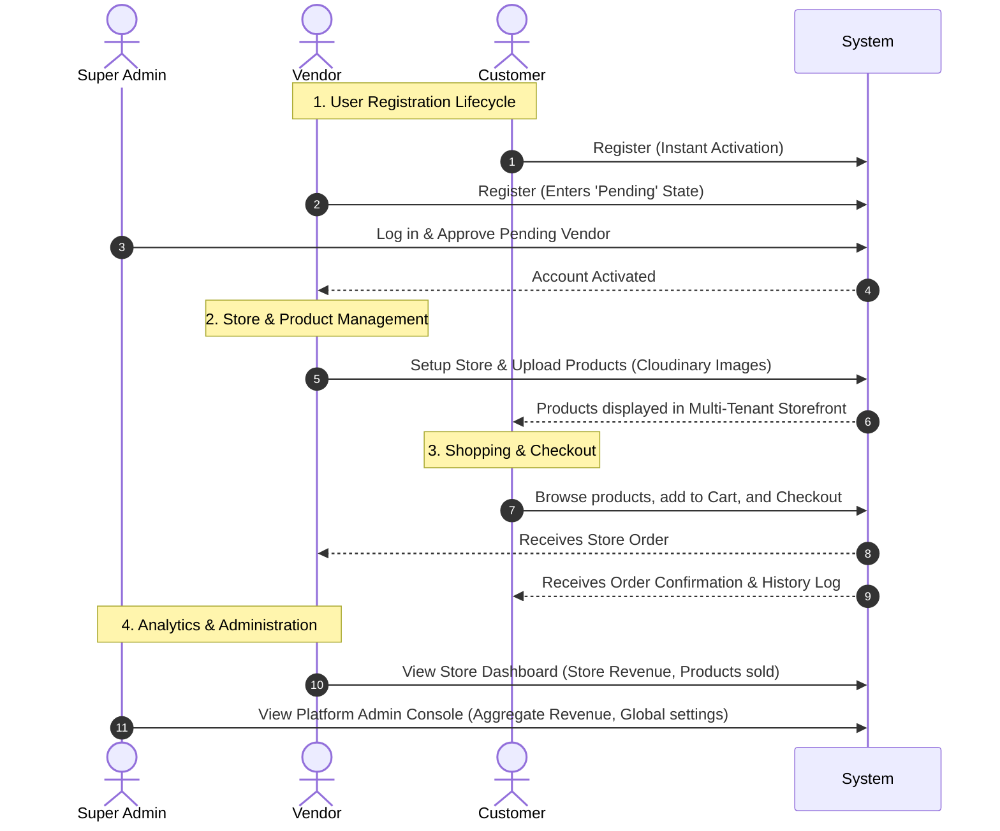

# 🛍️ OnShop: Multi-Tenant SaaS E-Commerce Platform

OnShop is a multi-tenant Software-as-a-Service (SaaS) e-commerce platform where multiple independent vendors can set up digital storefronts, and customers can browse, add items to a cart, and place orders. The platform features an automated security layer, approval systems, and interactive dashboards.

---

## 🔄 End-to-End System Workflow

This diagram outlines how the entire platform operates from user onboarding through to checkout and store analytics:



---

## 🛠️ Step-by-Step Platform Working Details

### 1. Account Lifecycle & User Onboarding
* **Customer Registration:** Customers sign up directly on the application. Registration is instantaneous, granting immediate access to the shopping storefront.
* **Vendor Application & Admin Verification:** Vendors apply by providing business credentials. Upon registration, their status is set to `pending`, preventing access. A Super Admin must log into the Admin portal, inspect the applicant's details, and approve them to change their status to `active`.
* **Platform Seeding:** The primary platform administrator (Super Admin) is seeded directly into the database through a command-line script.

### 2. Multi-Tenant Store Creation & Inventory Management
* **Store Creation:** Once approved, active Vendors can create a store profile. The system updates the User model with the newly generated `storeId`.
* **Product Catalog Management:** Vendors manage their inventory (create, edit, delete products) within their dashboard. Product images are uploaded directly to **Cloudinary** and saved as secure asset URLs in MongoDB.
* **Tenant Isolation:** Custom database queries filter products and orders by `storeId`, preventing vendors from viewing or modifying competitor inventories.

### 3. Shopping Cart & Order Checkout System
* **Contextual Browsing:** Customers browse unified product listings across different store tenants.
* **Persistent Shopping Cart:** Customers add products to a persistent cart. The system tracks item quantities, calculating price subtotals locally and verifying stock counts against the database.
* **Stateless Order Processing:** During checkout, the client signs the request using the customer's JWT token. The server decodes the customer's ID, verifies inventory levels, decrements product stock, and creates an order record.

### 4. Revenue Analytics & Platform Control
* **Vendor Dashboard:** Provides individual vendors with store-specific metrics (gross revenue, items sold, active orders).
* **Super Admin Dashboard:** Displays aggregated analytics covering all registered stores, platform-wide revenue, global order volume, and active user counts. Admins can suspend users or manage global settings.

---

## 🛡️ Core Security Architecture

* **Stateless Authentication:** All communication between frontend and backend is authenticated via a custom `Authorization: Bearer <JWT>` header, allowing secure verification without session store overhead.
* **Express Security Hardening:**
  * **Helmet.js:** Automatically configures HTTP headers to protect against clickjacking, cross-site scripting (XSS), and other injection vulnerabilities.
  * **Rate Limiting:** Protects authorization endpoints from dictionary attacks by restricting IPs to a maximum of 10 requests per 15 minutes.
  * **Input Sanitization:** Express-validator validates structural body payloads before data reaches controller levels.

---

## ⚙️ Environment Variables

Create a `.env` file in the `server` directory:

```env
PORT=5000
MONGO_URI=mongodb+srv://<username>:<password>@cluster.mongodb.net/onshop?retryWrites=true&w=majority&replicaSet=<your_replica_set>
JWT_SECRET=your_secure_random_jwt_secret_key_here
CLIENT_URL=http://localhost:5173
NODE_ENV=development
```

---

## ⚡ Getting Started

### 1. Installation

```bash
# Install Server packages
cd server
npm install

# Install Client packages
cd ../client
npm install
```

### 2. Seed Admin User

```bash
cd ../server
node seedAdmin.js
```
* **Super Admin Credentials:** `admin@onshop.com` / `Admin@123456`

### 3. Start Development Servers

**Run Backend API:**
```bash
cd server
npm run dev
```
*Runs on [http://localhost:5000](http://localhost:5000)*

**Run Frontend Client:**
```bash
cd client
npm run dev
```
*Runs on [http://localhost:5173](http://localhost:5173)*
